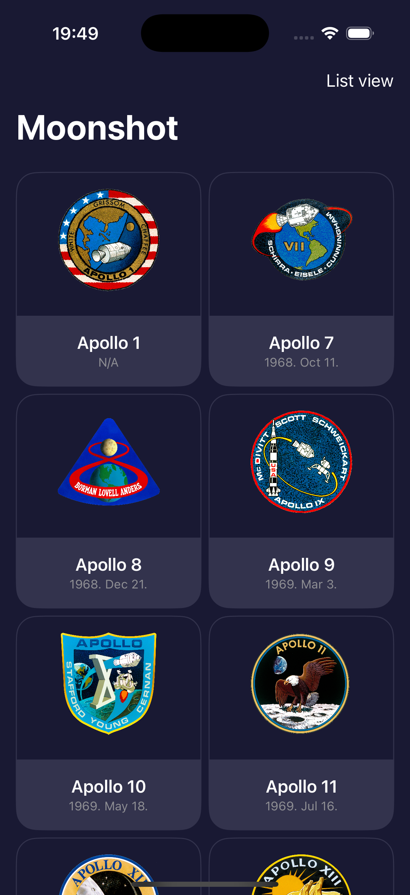
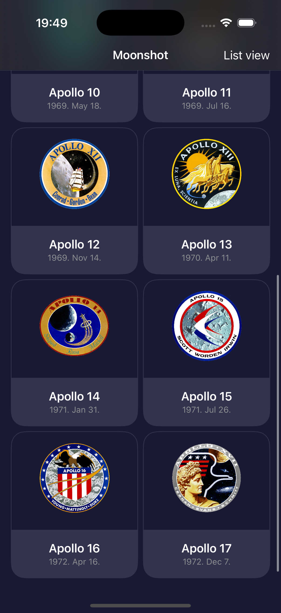
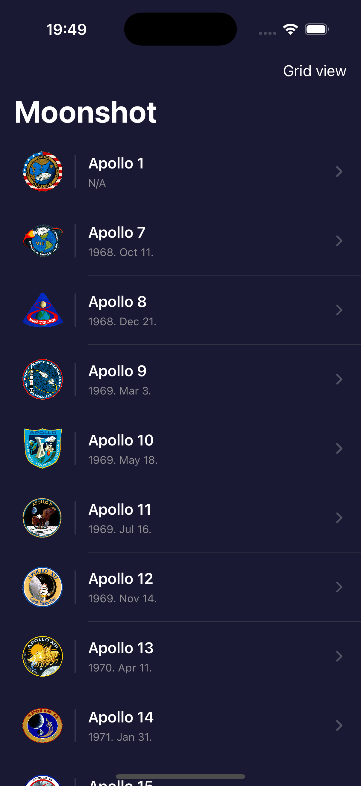
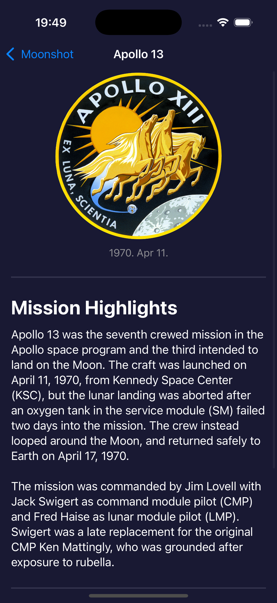
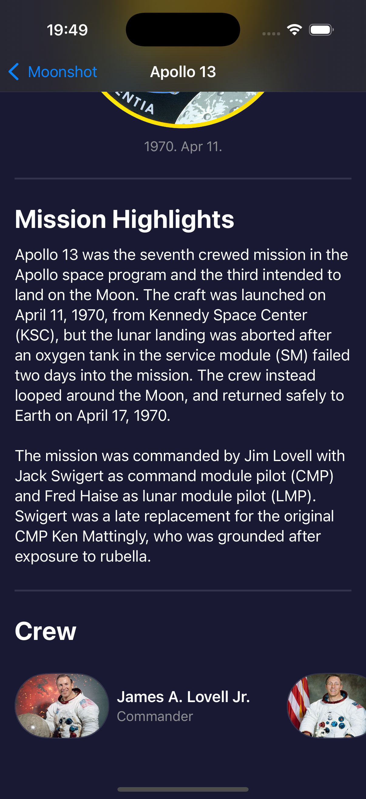
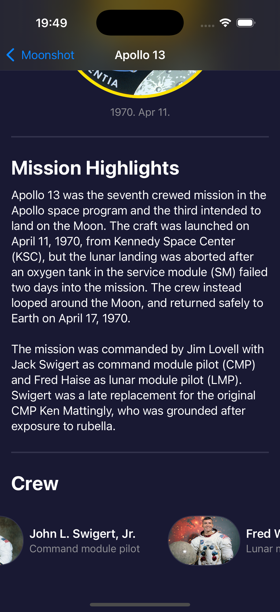

# Moonshot

**Moonshot** is a space exploration app built with SwiftUI. It showcases missions and astronauts, providing users with detailed information on various space missions, including Apollo missions. The app allows for toggling between a grid or list view for displaying missions.

---

## Features

- View space missions in either a grid or list layout
- Navigate through detailed mission pages with astronaut information
- View images and descriptions for each mission
- Use a simple, clean, dark-themed UI with SwiftUI
- Toggle between grid and list views with an easy-to-use toolbar button
- Fully implemented in SwiftUI with custom-designed views

---

## Screenshots

  
  
  
  
  

---

## License

This project is licensed under the [Creative Commons Attribution-NonCommercial 4.0 International License](https://creativecommons.org/licenses/by-nc/4.0/).

You may use and adapt this code for personal or educational purposes. Commercial use is prohibited without prior permission.

